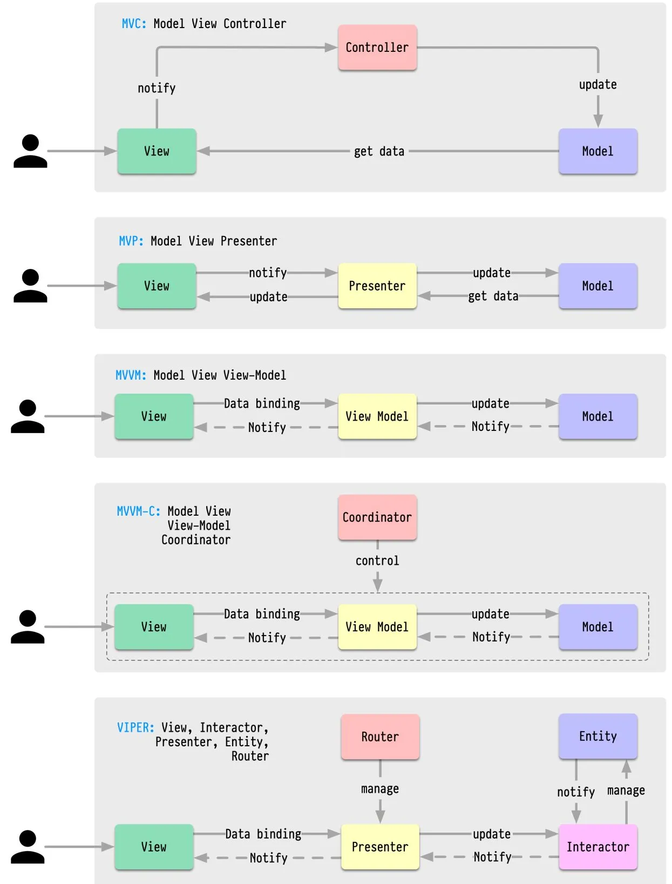
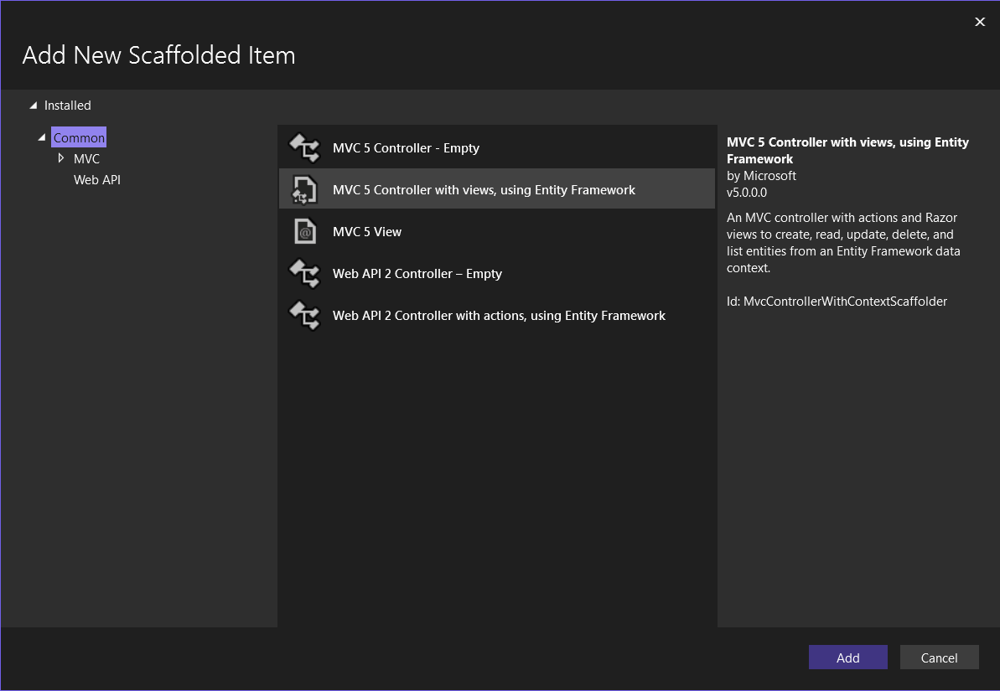
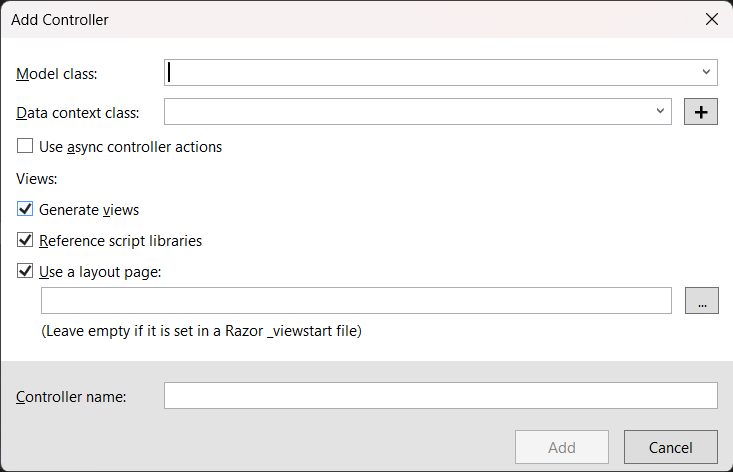

# Starting with ASP.NET

## Introduction

- **MVC**: Model-View-Controller.
- **ASP.NET**: Application Server Programming Interface.
- **C#**: C# is a high-level, compiled, object-oriented, generic, and interpreted programming language.

## MVC

- **Model**: It represents the data the application operates on.
- **View**: It represents the user interface.
- **Controller**: Manages user input and interaction determining which model to work with and view to render.

## Different Software Architucture Patterns



## MVC Project Setup in ASP.NET

1. Once you open `Visual Studio 2022`, or any other version of Visual Studio, you create a new project.
2. Select `ASP.NET Web Application`.
   - What this is, is a template for an ASP.NET Web Application with the MVC architecture.
   - **Keep in mind that it shouldn't contain a tag called `Core` as that is completely different.**
3. After choosing the template, you can create a new project.
4. In the next section, you will be asked to `Name` your project and set its path.
5. After this, you will be given a screen like this:
   
6. Here, you can choose the type of application you want.
   - For now, let us stick to an MVC application.
7. Once you create this, you will be able to see the project setup and all the folders and files present.

## MVC Project Files and Folders

- **Controllers** - It is a folder that contains the **Controller.cs** file.
- **Models** - It is a folder that contains the **Model.cs** file.
- **Views** - It is a folder that contains the **View.cs** file.
- **Content** - It is a folder that holds all the **Bootstarp CSS** files.
- **Scripts** - It is a folder that holds all the **Bootstarp JS** files.
- **References** - This is the folder which shows which all packages are referenced to this project.
- **packages.config** - This file appears only if you install any packages in this project.
- **Web.config** - This file has all the configurations that are handled for your application. Other files that help are the `BundleConfig.cs`, `FilterConfig.cs` and the `RouteConfig.cs` which are all located inside the `App_Start` folder.

## Starting the Project

- Whenever you are working with the **MVC Architucture**, it is always a good thing to download the `EntityFramework` package.
  - To do so:
    1. Click on **Tools**>>**NuGet Package Manager**>>**Package Manager Console**.
    2. Type `Install-Package EntityFramework` in the console.
- Let's now start building our first **ASP.NET MVC Project**.

### Building the MVC Project

#### Adding Model

1. **Right Click** on the `Models` folder and click on **Add**>>**Class** and name it `Student.cs`.
2. You should get something like this:

```C#
using System;
using System.Collections.Generic;
using System.Linq;
using System.Web;

namespace DemoForOneDrive.Models
{
    public class Student
    {
    }
}
```

- now, change it to:

```C#
using System;
using System.Collections.Generic;
using System.Linq;
using System.Web;

namespace DemoForOneDrive.Models
{
    public class Student
    {
        public int Id { get; set; }
        public string Name { get; set; }
    }
}
```

- what we have done is here is essentilly create a **Model** class for a **Student**, and it contains two properties, `Id` and `Name`.

#### Adding Context

1. for this **Model** and for others in the future, let us create a `DbContext` file which will help us link it to the `db` and manage `migrations`.
2. Go to the **Web.config** file and add this in the `<configurations></configurations>`

```config
<configurations>
<!-- all the other codes -->
<connectionStrings>
 <add name=<your-context-name> connectionString=<your-connection-string> providerName=<your-provider>/>
</connectionStrings>
</configurations>
```

- this is an example

```config
<connectionStrings>
 <add name="RecordContext" connectionString="Data Source=localhost\SQLEXPRESS;Initial Catalog=testing_database;Integrated Security=True;Pooling=False;Encrypt=False;TrustServerCertificate=True" providerName="System.Data.SqlClient"/>
</connectionStrings>
```

- now, let us make the **Context**. **Right Click** on the `Models` folder and click on **Add**>>**Class** and name it `RecordContext.cs`.

- inside it add the following code:

```C#
using System;
using System.Collections.Generic;
using System.Data.Entity;
using System.Linq;
using System.Web;

namespace DemoForOneDrive.Models
{
    public class RecordContext : DbContext
    {
        public RecordContext() : base("RecordContext") // this is the name that you have given inside the "connectionStrings" inside the `Web.config` file.
        {
        }

        public DbSet<Student> Students { get; set; }
        // here, you can add for all the other models that you will be creating in the future.

        protected override void OnModelCreating(DbModelBuilder modelBuilder)
        {
            base.OnModelCreating(modelBuilder);
        }
    }
}
```

- **IMPORTANT NOTE: do this only after you have successfuly installed the `Entity Framework`**
- **ALSO, MAKE SURE THAT THE PROJECT THAT YOU ARE WORKING ON IS NOT BEING SYNCED WITH `OneDrive` DURING DEVELOPMENT AS IT WILL HINDER THE FOLLOWING STEPS**

#### Adding Migration

- let us now establish the connection by adding pur first migration
- Open the `Nuget Package Manager` and type: `Enable-Migrations` in the console.

- Let's create the **Controller** and the **View** classes.
- But for now, let us use `Scaffolding` to create these.

#### Scaffolding

```markdown

Scaffolding in ASP.NET is a code generation framework that automatically creates the basic CRUD (Create, Read, Update, Delete) operations for a given model. It helps developers quickly set up the foundational parts of an application without writing repetitive code, thereby speeding up development. 
```

1. **Right Click** on the `Controllers` folder and click on **Add**>>**New Scaffolded Item**. After which you should get this section:

2. here, you need to click on `MVC 5 Controller with views, using Entity Framework`, then you will see this section:

3. here, you need to choose the **Model** and the **Context**. After this,your **Controller** will get a name automatically. Follow the naming convention as it will be easier for the **routing**, which we will get to soon.

- when you click on **Add**, you will now see that the **Controllers** and the **Views** folders are populated.
- this would be your **Controller.cs** file

```C#
using System;
using System.Collections.Generic;
using System.Data;
using System.Data.Entity;
using System.Linq;
using System.Net;
using System.Web;
using System.Web.Mvc;
using DemoForOneDrive.Models;

namespace DemoForOneDrive.Controllers
{
    public class DemoModelsController : Controller
    {
        private RecordContext db = new RecordContext();

        // GET: DemoModels
        public ActionResult Index()
        {
            return View(db.DemoModels.ToList());
        }

        // GET: DemoModels/Details/5
        public ActionResult Details(int? id)
        {
            if (id == null)
            {
                return new HttpStatusCodeResult(HttpStatusCode.BadRequest);
            }
            DemoModel demoModel = db.DemoModels.Find(id);
            if (demoModel == null)
            {
                return HttpNotFound();
            }
            return View(demoModel);
        }

        // GET: DemoModels/Create
        public ActionResult Create()
        {
            return View();
        }

        // POST: DemoModels/Create
        // To protect from overposting attacks, enable the specific properties you want to bind to, for 
        // more details see https://go.microsoft.com/fwlink/?LinkId=317598.
        [HttpPost]
        [ValidateAntiForgeryToken]
        public ActionResult Create([Bind(Include = "Id,Name,Description,Author")] DemoModel demoModel)
        {
            if (ModelState.IsValid)
            {
                db.DemoModels.Add(demoModel);
                db.SaveChanges();
                return RedirectToAction("Index");
            }

            return View(demoModel);
        }

        // GET: DemoModels/Edit/5
        public ActionResult Edit(int? id)
        {
            if (id == null)
            {
                return new HttpStatusCodeResult(HttpStatusCode.BadRequest);
            }
            DemoModel demoModel = db.DemoModels.Find(id);
            if (demoModel == null)
            {
                return HttpNotFound();
            }
            return View(demoModel);
        }

        // POST: DemoModels/Edit/5
        // To protect from overposting attacks, enable the specific properties you want to bind to, for 
        // more details see https://go.microsoft.com/fwlink/?LinkId=317598.
        [HttpPost]
        [ValidateAntiForgeryToken]
        public ActionResult Edit([Bind(Include = "Id,Name,Description,Author")] DemoModel demoModel)
        {
            if (ModelState.IsValid)
            {
                db.Entry(demoModel).State = EntityState.Modified;
                db.SaveChanges();
                return RedirectToAction("Index");
            }
            return View(demoModel);
        }

        // GET: DemoModels/Delete/5
        public ActionResult Delete(int? id)
        {
            if (id == null)
            {
                return new HttpStatusCodeResult(HttpStatusCode.BadRequest);
            }
            DemoModel demoModel = db.DemoModels.Find(id);
            if (demoModel == null)
            {
                return HttpNotFound();
            }
            return View(demoModel);
        }

        // POST: DemoModels/Delete/5
        [HttpPost, ActionName("Delete")]
        [ValidateAntiForgeryToken]
        public ActionResult DeleteConfirmed(int id)
        {
            DemoModel demoModel = db.DemoModels.Find(id);
            db.DemoModels.Remove(demoModel);
            db.SaveChanges();
            return RedirectToAction("Index");
        }

        protected override void Dispose(bool disposing)
        {
            if (disposing)
            {
                db.Dispose();
            }
            base.Dispose(disposing);
        }
    }
}

```

- here, you can see that the **Controller** is created successfully and is generated you all the features of `CRUD`.

### Routing in an ASP.NET MVC Application

- **Routing**: It is the process of determining which action or view to display when a user requests a particular URL. It is an important part of an MVC application.
- to check how your **ASP.NET MVC application** routes, you need to open the **RouteConfig.cs** file.
- in a nutshell, the **methods** in the **Controller** class are directly linked to the sub-files that you make with in the particular folder in the **Views** folder.
- for example, in your current project, the **Index** method oof the **DemoModelsController** is linked to the **Index.cshtml** file in the **DemoModules** folder in the **Views** folder.
- so this means, if you hit an endpoint `/DemoModels/Index`, you will be seeing what you have in the **Index.cshtml** file.
